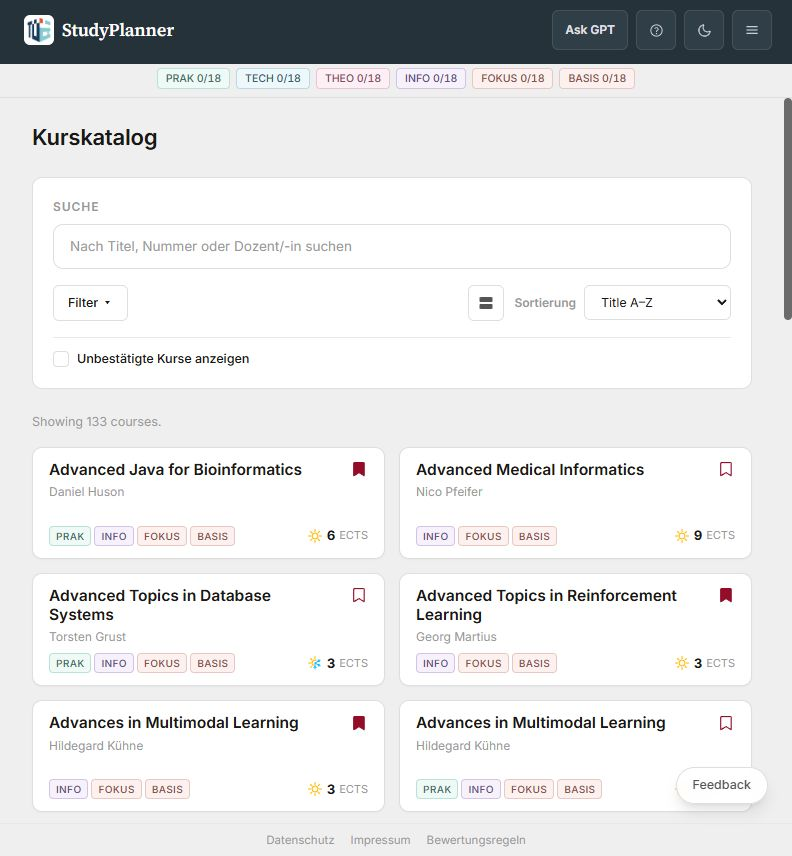

# StudyPlanner

Find your next course, plan your semester, and keep track of your degree at the
University of Tübingen. StudyPlanner is an independent student project for
Computer Science and related study programs.

**[Open the course catalog](https://studyplaner.pages.dev/catalog)** ·
[Local setup](docs/cloudflare-development.md) · [Documentation](docs/README.md)

[](https://studyplaner.pages.dev/catalog)

## What you can do

- Browse and filter the public ALMA catalog, with course details and schedules.
- Save favorites and build semester plans with a weekly calendar and calendar export.
- Import a Transcript of Records PDF in your browser, review results, and track progress.
- Check course assignments against your examination regulation and balance planned courses.
- Search the public catalog through the read-only [AI integrations](docs/ai-integrations-setup.md).

Catalog browsing is public. Personal plans and progress use an account. Tour
examples are isolated from real account data.

## AI integrations and public links

The public integration is read-only and requires no authentication. It supports
catalog search, course-number resolution and course details, with no access to
accounts, profiles, progress, semester plans, transcripts or credentials.

| Link | Purpose |
| --- | --- |
| [Web app and public gateway](https://studyplaner.pages.dev) | Main application and integration gateway |
| [AI metadata](https://studyplaner.pages.dev/api/ai/meta) | Integration metadata and discovery |
| [OpenAPI schema](https://studyplaner.pages.dev/api/ai/openapi.json) | Import URL for ChatGPT Custom GPT Actions; authentication: None |
| [MCP endpoint](https://studyplaner.pages.dev/mcp) | Remote Claude/MCP connector URL; authentication: None |
| [SSE discovery](https://studyplaner.pages.dev/sse) | Compatibility discovery URL for older MCP clients |
| [Privacy policy](https://studyplaner.pages.dev/privacy) | Privacy URL for integration setup |

The full [ChatGPT setup](docs/ai-integrations-setup.md#chatgpt-custom-gpt-setup)
retains the suggested GPT instructions and example prompts. The
[Claude/MCP setup](docs/ai-integrations-setup.md#claude--mcp-setup) includes the
Claude Desktop bridge configuration and discovery troubleshooting.
For the three-terminal backend/MCP/Pages workflow and request examples, use the
[local AI gateway smoke test](docs/ai-integrations-setup.md#local-smoke-test).

## Run locally

First time here? Follow the **[one-time setup](docs/cloudflare-development.md#one-time-setup)**
to install dependencies, configure a local auth secret, and prepare local D1.
Use Node.js 22.13+ and Python 3.11+. The setup guide records a known large-seed
import failure on fresh local databases; existing populated local databases can
use the daily commands below.

Then open **two terminals, both starting at the repository root**:

```powershell
# Frontend — http://localhost:5173
cd .\frontend\
npm run dev
```

```powershell
# Backend — http://localhost:8787
cd .\backend\
npx wrangler dev
```

Open [localhost:5173/catalog](http://localhost:5173/catalog).
These commands run development servers; they do not deploy to Cloudflare.
With `VITE_API_BASE_URL` unset, the local frontend uses `http://localhost:8787`.
Keep both servers running. See [troubleshooting](docs/cloudflare-development.md#troubleshooting)
if the catalog or login does not load.

## Project layout

| Directory | Purpose |
| --- | --- |
| [frontend/](frontend/README.md) | React 19, Vite, TypeScript, Tailwind CSS 4 and Pages Functions |
| [backend/](backend/README.md) | Python Cloudflare Worker, D1 migrations and import helpers |
| [data_collection/](data_collection/README.md) | Local ALMA and learning-platform collection tools |
| [integrations/studyplanner-mcp/](integrations/studyplanner-mcp/README.md) | Public MCP adapter |
| [docs/](docs/README.md) | Setup, deployment, feature contracts and operational notes |

## Checks

Run from the repository root:

```powershell
npm run test:frontend
npm --prefix frontend run lint
npm --prefix frontend run build
npm run db:verify-config
```

For transcript parser changes, also run `npm --prefix frontend run validate:transcripts`
with the local fixtures described in the [frontend guide](frontend/README.md).
See [AGENTS.md](AGENTS.md) for branch, test and commit conventions.

## Deployment and operations

Use the [deployment guide](docs/cloudflare-setup.md) for Pages and Worker commands.
The active D1 database is `studyplanner-db`, bound as `DB`. Do not recreate or swap
it during deployment. Keep `AUTH_TOKEN_SECRET` out of Git.

[Runtime configuration](docs/cloudflare-runtime-config.md) documents resource names,
catalog refresh safeguards and the production-wide simulated-semester toggle.
[Authentication](docs/authentication.md) explains cookies and CSRF protection.

| Database | Name | ID |
| --- | --- | --- |
| Active, binding `DB` | `studyplanner-db` | `80ca9092-ddc6-454a-b04a-8ccae85ef2f5` |
| Previous test database | `studyplaner-db-test` | `297f7a28-9069-431d-b989-49acf2537513` |

Changing the active binding requires explicit approval. Database IDs are public
configuration; signing secrets and generated credentials must never be committed.

### Simulated semester

The existing onboarding test toggle sets `SS 2025`, so the upcoming winter is
`WS 2025/26`. These commands run from the repository root:

```powershell
npm run sim:status  # read the current production setting
npm run sim:on      # set the simulated current semester to SS 2025
npm run sim:off     # restore the real, date-derived semester
```

`sim:on` and `sim:off` write to production D1 and affect all visitors after reload,
without a redeploy. See [runtime configuration](docs/cloudflare-runtime-config.md#simulated-semester)
for the setting and how to choose a different semester.

### Documentation shortcuts

- [AI integration setup](docs/ai-integrations-setup.md)
- [Runtime configuration and catalog refresh](docs/cloudflare-runtime-config.md)
- [Local development and database setup](docs/cloudflare-development.md)
- [Authentication and request security](docs/authentication.md)
- [Mobile testing](docs/mobile-testing.md)
- [Backend routes and tooling](backend/README.md)
- [July repository overhaul report](docs/repository-overhaul-2026-07.md) — historical
- [July code simplification audit](docs/code-simplification-audit-2026-07.md) — historical

All documents previously listed in this README remain available above. Detailed
setup examples live in their linked guides; the [documentation index](docs/README.md)
covers the rest of the repository.

[Privacy](https://studyplaner.pages.dev/privacy) ·
[Imprint](https://studyplaner.pages.dev/impressum)
